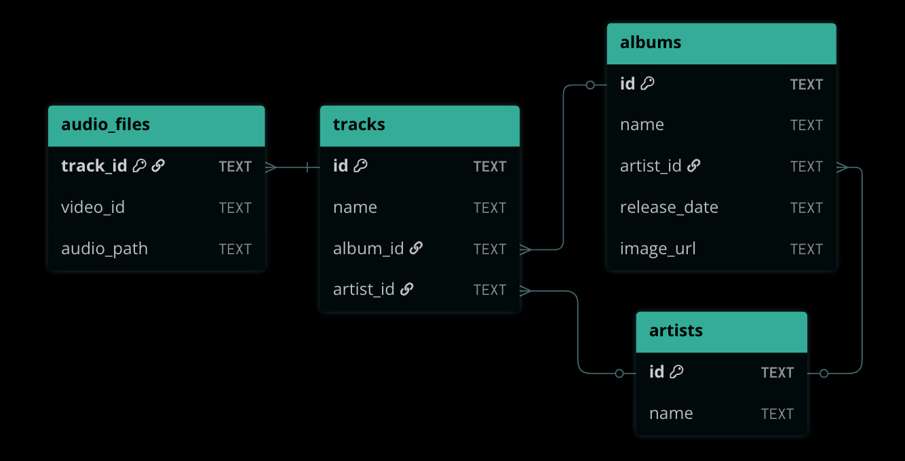

# Package Installation:
```bash
git clone https://github.com/dennisfarmer/musicdl.git
python3 -m venv .venv && source .venv/bin/activate
pip3 install -e ./musicdl
```

```bash
# contents of .env (see config.py for details):
SPOTIPY_CLIENT_ID="your client id here"
SPOTIPY_CLIENT_SECRET="your client secret here"
MUSIC_DB="./data/music.db"    # optional
AUDIO_STORAGE="./data/mp3s"   # optional
```

To obtain Spotify credentials:
- Create a (free) Spotify account
- Follow the steps listed in the [Getting started with Web API](https://developer.spotify.com/documentation/web-api/tutorials/getting-started) guide.
    - The Redirect URIs section is required but not used; https://example.com/callback is fine
    - Make sure that "Web API" is selected as one of the APIs being used
    - This application does follow the Developer Terms [Section IV restrictions](https://developer.spotify.com/terms#section-iv-restrictions) on training a machine learning or AI model with Spotify content, since the model will be using the raw audio data obtained from YouTube.

# Overview:

1. Use `musicdl -u / musicdl -f` to update database with new mp3s and metadata



2. Use `musicdl --export` to save all tracks to CSV for further processing

|track_id|track_name|artist_id|artist_name|album_id|album_name|release_date|image_url|video_id|audio_path|
|:------:|:--------:|:-------:|:---------:|:------:|:--------:|:----------:|:-------:|:------:|:--------:|
|7AzlLxHn24DxjgQX73F9fU|No Idea|4Gso3d4CscCijv0lmajZWs|Don Toliver|7z4GhRfLqfSkqrj5F3Yt2B|Heaven Or Hell|2020-03-13|https://i.scdn.co/image/ab67616d0000b27345190a074bef3e8ce868b60c|_r-nPqWGG6c|./data/mp3s/10/DonToliver_NoIdea_r-nPqWGG6c.mp3|

3. `musicdl` is usable as both a command line script,
```bash
tail -n2 pyproject.toml
# [project.scripts]
# musicdl = "musicdl.cli:main"

source .venv/bin/activate && which musicdl
# /home/username/musicdl/.venv/bin/musicdl
```
...as well as a Python package:
```python
# ------------------------------------------------------------------------------
# the following line runs the code contained in src/musicdl/__main__.py:
# python3 -m musicdl -u "https://open.spotify.com/artist/4Gso3d4CscCijv0lmajZWs"
# ------------------------------------------------------------------------------

#!/usr/bin/env python 

from musicdl.cli import MusicDownloader
mdl = MusicDownloader()
artist = mdl.from_url("https://open.spotify.com/artist/4Gso3d4CscCijv0lmajZWs")

type(artist)  
# musicdl.Artist object, 
#   containing a dict[album_id, musicdl.Album], 
#     each containing a dict[track_id, musicdl.Track]
#       each referencing a downloaded mp3 file
```

# Command Line Example:
```bash
musicdl -u "https://open.spotify.com/track/7AzlLxHn24DxjgQX73F9fU?si=0684264878094a00"

# alternative: provide a file containing many urls
echo "https://open.spotify.com/track/7AzlLxHn24DxjgQX73F9fU" > tracks.txt
musicdl -f tracks.txt

# Track - No Idea by Don Toliver (2020-03-13) - 7AzlLxHn24DxjgQX73F9fU
        # artist_id = 4Gso3d4CscCijv0lmajZWs
        # album_id = 7z4GhRfLqfSkqrj5F3Yt2B
        # album_name = Heaven Or Hell
        # image_url = https://i.scdn.co/image/ab67616d0000b27345190a074bef3e8ce868b60c
        # release_date = 2020-03-13
        # video_id = _r-nPqWGG6c
        # audio_path = ./data/mp3s/10/DonToliver_NoIdea_r-nPqWGG6c.mp3

tree ./data
#    ├── mp3s
#    │   └── 10
#    │       └── DonToliver_NoIdea_r-nPqWGG6c.mp3
#    ├── music.db
#    └── tracks.csv
```

[](https://www.youtube.com/watch?v=_r-nPqWGG6c)

# Help Page: `musicdl --help`

```
usage: musicdl [-h] [-u [URLS ...]] [-f [FILE]] [--export] [--uninstall]

Download music audio from Youtube, using Spotify urls to obtain track info
Supports tracks, albums, playlists, and artists

options:
---------------------------------------------------------

  -h, --help     show this help message and exit
                 
---------------------------------------------------------
                 
  -u [URLS ...]  download mp3s using one or more Spotify urls
                 note: be sure to surround each url with double quotes
                 
                 musicdl -u \
                   "https://open.spotify.com/album/2YuS718NZa9vTJk9eoyD9B" \
                   "https://open.spotify.com/playlist/5E9bcB7cxoDOuT6zHcN2zB"
                 
---------------------------------------------------------
                 
  -f [FILE]      download mp3s using a text file containing Spotify urls
                 
                 cat << EOF > example.txt
                 "https://open.spotify.com/artist/4A8byZgEqs8YRqUQ2HMmhA"
                 "https://open.spotify.com/track/7AzlLxHn24DxjgQX73F9fU"
                 EOF
                 
                 musicdl -f example.txt
                 
---------------------------------------------------------
                 
  --export       save music database to a CSV file for further processing
                 
                 musicdl --export
                 tree ./data
                      ├── mp3s
                      │   └── 10
                      │       └── DonToliver_NoIdea_r-nPqWGG6c.mp3
                      ├── music.db
                      └── tracks.csv  <--
                 
---------------------------------------------------------
                 
  --uninstall    uninstall musicdl's yt-dlp binary
                 
                 Equivalent to:
                   rm /Users/dennisfj/Library/Caches/musicdl/yt-dlp*
                   rmdir /Users/dennisfj/Library/Caches/musicdl
                 
---------------------------------------------------------
```

todo:
- add some better logging / output
